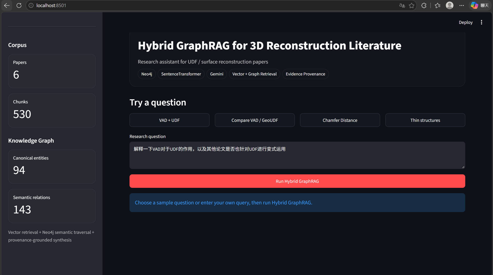
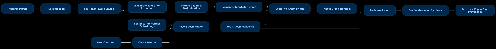
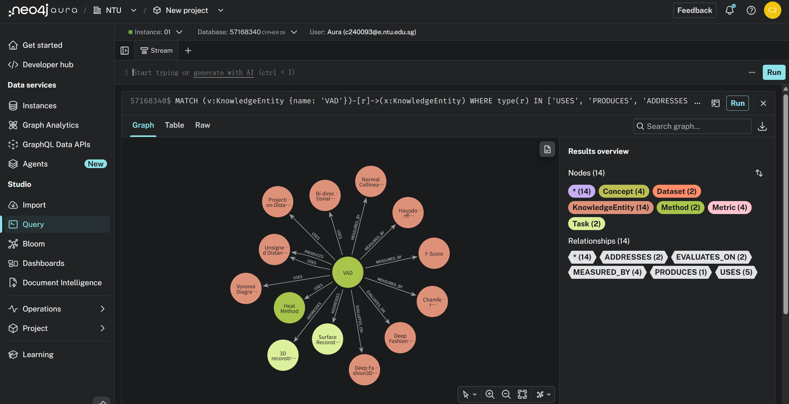

<div align="center">

# Hybrid GraphRAG for 3D Reconstruction Literature

**A provenance-aware research assistant that combines vector retrieval, semantic knowledge graphs, and grounded LLM synthesis for 3D reconstruction and unsigned distance field (UDF) literature.**


</div>

---

## Overview

This project builds an end-to-end **Hybrid GraphRAG** pipeline over a focused corpus of research papers in **unsigned distance fields, surface reconstruction, and 3D geometry**.

Instead of relying on vector similarity alone, the system combines:

- token-aware document chunking
- 384-D local SentenceTransformer embeddings
- Neo4j vector search
- LLM-assisted semantic entity / relation extraction
- deterministic schema validation
- cross-batch entity normalization and deduplication
- semantic knowledge graph traversal
- vector-to-graph bridging
- chunk-level provenance recovery
- Gemini grounded answer synthesis
- Streamlit visualization and inspection

### Project scale

| Item | Current build |
|---|---:|
| Research papers | **6** |
| Extracted pages | **84** |
| Token-aware chunks | **530** |
| Embedding dimension | **384** |
| Canonical semantic entities | **94** |
| Canonical semantic relations | **143** |
| Semantic entity types | Method, Concept, Task, Dataset, Metric, Model |
| Front end | Streamlit |
| Graph / vector database | Neo4j Aura |

---

## Application



The Streamlit application exposes the complete retrieval pipeline, corpus statistics, example questions, vector Top-K configuration, grounded answers, graph facts, and supporting evidence.

---

## End-to-End Demo

**▶ [Watch the ~1 minute Hybrid GraphRAG demo](assets/02_demo.mp4)**

The demo shows:

1. a research question entered through Streamlit;
2. multilingual query rewriting for English-heavy retrieval;
3. vector retrieval from the paper corpus;
4. graph seed detection;
5. Neo4j semantic traversal;
6. provenance recovery;
7. grounded answer generation with paper/page evidence;
8. inspection of vector results, graph facts, and source chunks.

---

## System Architecture



At inference time, the system combines two evidence channels:

```text
User Question
      |
      +--------------------------+
      |                          |
      v                          v
Query Rewrite              Lexical Entity Match
      |                          |
      v                          |
SentenceTransformer             |
      |                          |
      v                          |
Neo4j Vector Search             |
      |                          |
      v                          |
Top-K Chunks                    |
      |                          |
      +---- Vector-to-Graph -----+
                   |
                   v
          Semantic KG Seeds
                   |
                   v
          Neo4j Graph Traversal
                   |
                   v
          Provenance Recovery
                   |
          +--------+--------+
          |                 |
          v                 v
    Vector Evidence    Graph Evidence
          \                 /
           \               /
            v             v
           Evidence Fusion
                  |
                  v
          Gemini Synthesis
                  |
                  v
       Grounded Research Answer
```

---

## Semantic Knowledge Graph



The semantic layer represents explicit research relationships such as:

```text
Paper --INTRODUCES--> Method

Method --USES--> Concept
Method --ADDRESSES--> Task
Method --EVALUATES_ON--> Dataset
Method --MEASURED_BY--> Metric
Method --IMPROVES--> Method
Method --COMPARED_WITH--> Method
Method --PRODUCES--> Concept

KnowledgeEntity --SUPPORTED_BY--> Chunk
```

For example, the VAD-centered graph contains relations such as:

```text
VAD --USES--> Voronoi Diagram
VAD --USES--> Projection Distance Field
VAD --USES--> Bi-directional Normal
VAD --PRODUCES--> Unsigned Distance Field
VAD --MEASURED_BY--> Chamfer Distance
```

The `SUPPORTED_BY` layer links semantic entities back to source chunks so graph retrieval can recover paper-level evidence rather than relying only on symbolic triples.

---

# Reproducing the Project

## 1. Clone and create an environment

```powershell
git clone https://github.com/Franky5278/Hybrid-graphrag-3d-reconstruction.git
cd hybrid-graphrag-3d-reconstruction

python -m venv .venv
.\.venv\Scripts\Activate.ps1

python -m pip install --upgrade pip
pip install -r requirements.txt
```

The project was developed with **Python 3.11** on Windows.

---

## 2. Configure environment variables

Copy the example file:

```powershell
Copy-Item .env.example .env
```

Then edit `.env` locally:

```env
NEO4J_URI=neo4j+s://YOUR_INSTANCE.databases.neo4j.io
NEO4J_USERNAME=neo4j
NEO4J_PASSWORD=YOUR_NEO4J_PASSWORD
NEO4J_DATABASE=neo4j

GEMINI_API_KEY=YOUR_GEMINI_API_KEY
```

> **Never commit `.env`.** It is excluded by `.gitignore`.

---

## 3. Prepare the paper corpus

Source PDFs are intentionally **not included** in this repository.

Place your legally obtained copies under:

```text
data/papers/
```

The development corpus contained six papers covering methods including:

- DCUDF2
- DM-UDF
- Metric-Phase Fields (MPFs)
- GeoUDF
- SuperUDF
- VAD

Expected development filenames included:

```text
DCUDF2 Improving Efficiency and Accuracy in.pdf
Learning_Density_Regulated_and_Multi-View_Consistent_Unsigned_Distance_Fields.pdf
Metric—Phase Fields Decoupling Distance and Sign for Thin-Structure.pdf
Ren_GeoUDF_Surface_Reconstruction_from_3D_Point_Clouds_via_Geometry-guided_Distance_ICCV_2023_paper.pdf
SuperUDF Self-supervised UDF Estimation for.pdf
TOG 2026 - VAD (revised version).pdf
```

---

# Full Pipeline

## 4. Extract PDF text

```powershell
python src\extract_papers.py
```

The extractor scans PDFs, preserves page boundaries, cleans invalid Unicode surrogates, and writes extracted text to `data/processed/`.

Development corpus:

```text
6 PDFs
84 / 84 non-empty pages
```

---

## 5. Build token-aware chunks

```powershell
python src\chunk_papers.py
```

Chunking configuration used during development:

```text
chunk size      = 220 tokens
chunk overlap   = 40 tokens
step size       = 180 tokens
```

Per-chunk metadata includes:

```text
chunk_id
paper_id
source_file
page
chunk_index
token_start
token_end
token_count
char_start
char_end
text
```

Development output:

```text
530 chunks
```

---

## 6. Build the Neo4j vector index

```powershell
python src\index_real_papers.py
```

This step embeds all chunks with:

```text
sentence-transformers/all-MiniLM-L6-v2
```

and creates the Neo4j vector index:

```text
paper_chunk_embeddings
```

The document graph uses:

```text
(:Paper)-[:HAS_CHUNK]->(:Chunk)
```

---

## 7. Test plain vector RAG

```powershell
python src\real_paper_rag.py
```

Useful diagnostics:

```powershell
python src\test_embedding.py
python src\test_neo4j.py
python src\test_gemini.py
python src\query_vector.py
python src\query_graph.py
python src\compare_retrieval.py
```

---

# Semantic Knowledge Graph Construction

## 8. Extract semantic entities and relations

```powershell
python src\extract_semantic_kg_full.py
```

Allowed entity types:

```text
Method
Concept
Task
Dataset
Metric
Model
```

Main relation types:

```text
INTRODUCES
USES
ADDRESSES
EVALUATES_ON
MEASURED_BY
IMPROVES
COMPARED_WITH
PRODUCES
SOLVES
```

Development run:

```text
6 papers
530 chunks
48 extraction batches
```

The script supports checkpoint/resume behavior, so completed batches can be skipped after temporary API failures or rate limits.

---

## 9. Normalize and deduplicate the semantic KG

```powershell
python src\normalize_semantic_kg.py
```

This stage performs alias normalization, cross-batch entity deduplication, type consistency checks, relation validation, evidence merging, and removal of obvious noise.

Development result:

```text
258 raw entity occurrences
   -> 94 canonical entities

240 raw relation occurrences
   -> 143 canonical relations
```

Generated artifacts:

```text
data/kg/kg_canonical.json
data/kg/kg_canonical_entities.jsonl
data/kg/kg_canonical_relations.jsonl
data/kg/paper_profiles.json
```

---

## 10. Write the semantic graph to Neo4j

```powershell
python src\write_semantic_kg_to_neo4j.py
```

The development database contained:

```text
KnowledgeEntity nodes:             94
Paper -> INTRODUCES edges:          6
Entity -> Entity semantic edges:  137
Entity -> Chunk SUPPORTED_BY:     337
```

---

# Hybrid GraphRAG

## 11. Run the terminal version

```powershell
python src\hybrid_graphrag_real_v2.py
```

Example question:

```text
解释一下VAD对于UDF的作用，以及其他论文是否也针对UDF进行变式运用
```

The backend performs:

```text
multilingual query rewrite
-> vector retrieval
-> lexical entity detection
-> vector-to-graph bridge
-> first-hop semantic traversal
-> secondary focal-method expansion
-> provenance chunk recovery
-> vector + graph evidence fusion
-> Gemini grounded synthesis
```

Direct CLI query:

```powershell
python src\hybrid_graphrag_real_v2.py `
  -q "How does VAD use Voronoi geometry for unsigned distance field reconstruction?"
```

Other useful test questions:

```text
How do VAD and GeoUDF differ in their use of unsigned distance fields?

Which methods in these papers are evaluated using Chamfer Distance?

Which paper focuses on thin-structure reconstruction and how does it differ from standard UDF approaches?
```

---

# Streamlit Demo

## 12. Launch the UI

```powershell
streamlit run app_v2.py
```

The app exposes example questions, configurable Vector Top-K, grounded answers, retrieval metrics, vector results, graph seeds, semantic relations, source evidence, and pipeline diagnostics.

### Streamlit file-watcher configuration

The repository includes:

```text
.streamlit/config.toml
```

with:

```toml
[server]
fileWatcherType = "none"
```

This avoids unnecessary optional `transformers` vision-module imports from Streamlit's file watcher.

Equivalent command-line launch:

```powershell
streamlit run app_v2.py --server.fileWatcherType none
```

---

# Neo4j Query Cookbook

These queries are useful for debugging and reproducing graph visualizations.

## Show real paper nodes

```cypher
MATCH (p:Paper)
WHERE p.paper_id IS NOT NULL
RETURN p;
```

## Count chunks per paper

```cypher
MATCH (p:Paper)-[:HAS_CHUNK]->(c:Chunk)
RETURN p.source_file AS paper, count(c) AS chunks
ORDER BY chunks DESC;
```

## Visualize the VAD semantic subgraph

```cypher
MATCH (v:KnowledgeEntity {name: "VAD"})-[r]->(x:KnowledgeEntity)
WHERE type(r) IN [
    "USES",
    "PRODUCES",
    "ADDRESSES",
    "MEASURED_BY",
    "EVALUATES_ON"
]
RETURN v, r, x;
```

## Show all VAD semantic relations

```cypher
MATCH (v:KnowledgeEntity {name: "VAD"})-[r]->(x:KnowledgeEntity)
RETURN
    v.name AS source,
    type(r) AS relation,
    x.name AS target,
    x.entity_type AS target_type
ORDER BY relation, target;
```

## Count semantic entities by type

```cypher
MATCH (e:KnowledgeEntity)
RETURN e.entity_type AS entity_type, count(e) AS count
ORDER BY count DESC;
```

## Count semantic relation types

```cypher
MATCH (:KnowledgeEntity)-[r]->(:KnowledgeEntity)
RETURN type(r) AS relation, count(r) AS count
ORDER BY count DESC;
```

## Show paper -> focal method links

```cypher
MATCH (p:Paper)-[r:INTRODUCES]->(m:KnowledgeEntity)
RETURN p, r, m;
```

## Inspect evidence provenance

```cypher
MATCH (e:KnowledgeEntity {name: "VAD"})-[:SUPPORTED_BY]->(c:Chunk)
RETURN
    e.name AS entity,
    c.source_file AS paper,
    c.page AS page,
    c.chunk_id AS chunk_id,
    c.text AS evidence
ORDER BY page
LIMIT 20;
```

## Explore cross-paper comparisons

```cypher
MATCH (m:KnowledgeEntity)-[r:COMPARED_WITH]->(other:KnowledgeEntity)
WHERE m.name IN [
    "VAD",
    "GeoUDF",
    "SuperUDF",
    "DCUDF2",
    "DM-UDF",
    "MPFs"
]
RETURN m, r, other;
```

## Inspect UDF-related method connections

```cypher
MATCH (m:KnowledgeEntity)-[r:USES|PRODUCES]->(u:KnowledgeEntity)
WHERE u.name = "Unsigned Distance Field"
RETURN m, r, u;
```

## Check the vector index

```cypher
SHOW INDEXES
YIELD name, type, state, populationPercent
WHERE name = "paper_chunk_embeddings"
RETURN name, type, state, populationPercent;
```

---

# Repository Structure

```text
.
├── .env.example
├── .gitignore
├── .streamlit/
│   └── config.toml
├── app.py
├── app_v2.py
├── requirements.txt
├── assets/
│   ├── 01_app_overview.png
│   ├── 02_demo.mp4
│   ├── 03_neo4j_vad_graph.png
│   └── 04_architecture.png
├── data/
│   └── kg/
│       ├── kg_canonical.json
│       ├── kg_canonical_entities.jsonl
│       ├── kg_canonical_relations.jsonl
│       └── paper_profiles.json
└── src/
    ├── extract_papers.py
    ├── chunk_papers.py
    ├── index_real_papers.py
    ├── real_paper_rag.py
    ├── extract_semantic_kg_full.py
    ├── normalize_semantic_kg.py
    ├── write_semantic_kg_to_neo4j.py
    ├── hybrid_graphrag_real_v2.py
    └── ...
```

---

# Design Notes

### Why not vector RAG only?

Vector search retrieves semantically similar passages, but many research questions also require explicit relationships such as:

```text
method -> concept
method -> dataset
method -> metric
method -> comparison method
```

The semantic KG exposes these relationships directly and allows the retrieval pipeline to traverse them.

### Why keep provenance links?

A graph triple such as:

```text
VAD --USES--> Voronoi Diagram
```

is useful for traversal but not sufficient by itself for a grounded research answer. The system therefore stores:

```text
KnowledgeEntity --SUPPORTED_BY--> Chunk
```

and relation-level evidence metadata so final synthesis can recover source text and paper/page context.

### Why deterministic validation after LLM extraction?

Unrestricted LLM extraction can create duplicate aliases, overly generic nodes, related-work noise, and unsupported relation types. The pipeline therefore applies schema rules and global normalization before writing the graph to Neo4j.

---

# Current Limitations

- The current corpus is intentionally small and domain-specific.
- Entity normalization includes manually defined aliases for obvious UDF / method / metric naming variants.
- Retrieval quality still depends on the embedding model and PDF extraction quality.
- Gemini service availability and rate limits may temporarily affect query rewriting, semantic extraction, or synthesis.
- The system has not yet been evaluated with a formal retrieval benchmark such as Recall@K, MRR, or a human-graded GraphRAG-vs-vector-RAG study.
- Some semantically equivalent dataset/task names may still remain as separate canonical nodes.
- The Streamlit application assumes an already populated Neo4j database.

---

# Future Work

Potential extensions include:

- larger 3D reconstruction / embodied-AI literature corpora;
- embedding-assisted entity resolution;
- graph-aware reranking;
- formal Vector RAG vs Hybrid GraphRAG evaluation;
- interactive node-link visualization directly inside Streamlit;
- incremental paper ingestion;
- citation-level claim verification;
- retrieval tracing and latency profiling;
- containerized deployment.

---

## Security

Secrets are loaded from `.env` and excluded from version control.

Before publishing a fork, verify:

```powershell
git check-ignore -v .env
git ls-files .env
git grep --cached -n -I -E "AIza[A-Za-z0-9_-]{20,}"
```

The included `.env.example` contains placeholders only.

---

<div align="center">

**Built as a practical exploration of vector retrieval, semantic knowledge graphs, provenance-aware RAG, and AI-assisted research tooling for 3D reconstruction literature.**

</div>
